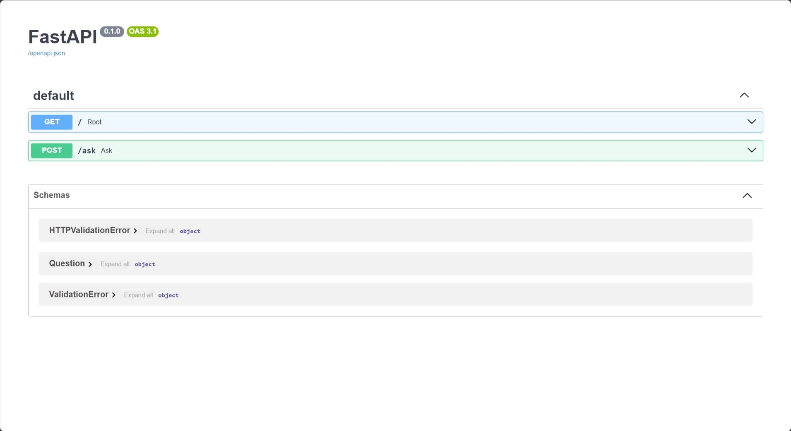

# Arcfusion RAG & Web search Application

### Running as a CLI application

```bash
# clone repository
git clone https://github.com/dheerapat/arcfusion.git
cd arcfusion
cp .env.example .env # setup api key

# sync dependency
uv sync
#usage example
uv run graph.py "<question>"

# example
uv run graph.py "Which prompt template gave the highest zero-shot accuracy on Spider in Zhang et al.(2024)?"
```

### Running as a FastAPI application

```bash
# clone repository
git clone https://github.com/dheerapat/arcfusion.git
cd arcfusion
cp .env.example .env # setup api key

# sync dependency
uv sync
#usage example
uv run fastapi run server.py

# go to http://localhost:8000/docs and try with interactive UI
```

### Running as a docker container

```bash
git clone https://github.com/dheerapat/arcfusion.git
cd arcfusion
cp .env.example .env # setup api key

# build and run docker
docker build -t arcfusion .
docker run -p 8000:8000 --env-file .env arcfusion

# go to http://localhost:8000/docs and try with interactive UI
# or run curl command
curl -X 'POST' \
  'http://localhost:8000/ask' \
  -H 'accept: application/json' \
  -H 'Content-Type: application/json' \
  -d '{
  "question": "Which prompt template gave the highest zero-shot accuracy on Spider in Zhang et al.(2024)?"
}'
```
### Screenshot


### Features
- PDF RAG workflow with web search fall back
- Running using docker

#### Limitation
- Multiturn conversation
- User session
- Each API call = new graph initialization (new PDF loading)
- PDF upload during FastAPI running session
- Clear memory during FastAPI running session